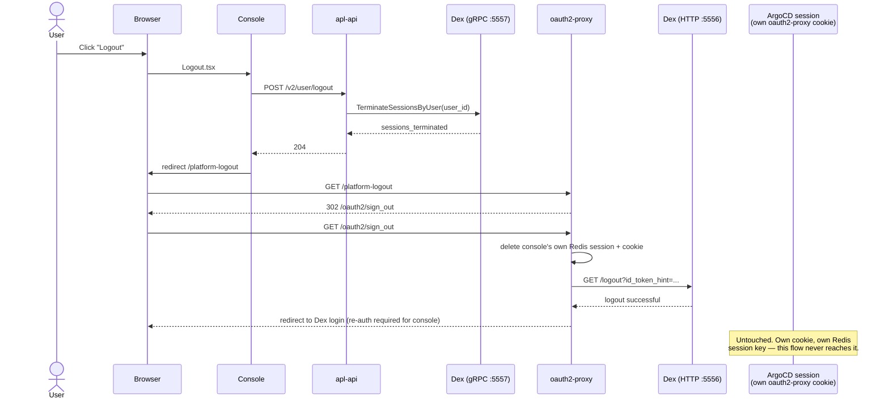

# Dex logout does not propagate to other apps' oauth2-proxy sessions

- Status: proposed

## Context and Problem Statement

`apl-api`'s self-service logout (`POST /v2/user/logout`) and the console's existing `/platform-logout` redirect together terminate the user's Dex SSO session and the console's own oauth2-proxy session. They do not touch any other app's session: a user who had ArgoCD (or any other app behind oauth2-proxy) open in another tab stays logged in there after clicking Logout in the console.

### Current flow

Every app behind oauth2-proxy gets its own session cookie, scoped to its own hostname: `cookie_domains` in `values/oauth2-proxy/oauth2-proxy.gotmpl` is an explicit per-host allowlist, not a shared wildcard domain — changed deliberately to close an InfoSec finding on cross-app cookie/token theft. Reverting that is not an option.

Sessions live in a shared Redis (`sessionStorage.type: redis`), but oauth2-proxy keys each session by a random per-cookie ticket, not by user, and half the decryption secret exists only in the browser's cookie, never server-side. There is no way to enumerate or delete "every session belonging to user X" from outside oauth2-proxy without patching it.

## Decision Drivers

- Must not reopen the InfoSec finding that motivated per-host `cookie_domains`.
- Prefer reusing oauth2-proxy's existing `backend_logout_url` mechanism over inventing new session-management infrastructure.
- Logout should feel instant; relying solely on `cookie_refresh` (currently `1m`) leaves a window where another app still accepts the old session.

## Considered Options

- **Tune `cookie_refresh` lower** — Dex-side logout already revokes the user's refresh tokens, so a shorter refresh interval may shrink the exposure window close to zero with no new code. Cheapest option; being measured first in [TBD: Jira ticket].
- **Sequential top-level redirect chain** through every platform app's own `/oauth2/sign_out` on logout. Reuses the existing `backend_logout_url` mechanism and respects `cookie_samesite = "lax"` (top-level navigations carry cookies; cross-origin iframes/fetches do not). Redirect count scales with the number of apps/teams on the cluster.
- **Scoped redirect chain** — same mechanism, but only chain through apps the user actually visited this session (tracked client-side), keeping the chain short in practice.
- **User-indexed Redis session store** for a true single-request kill-all, no visible redirect chain. Best UX, but requires patching or wrapping oauth2-proxy to maintain a user → session-key index; meaningfully bigger and riskier than the other options.

## Decision Outcome

Pending. Tracked in [TBD: Jira ticket link].
