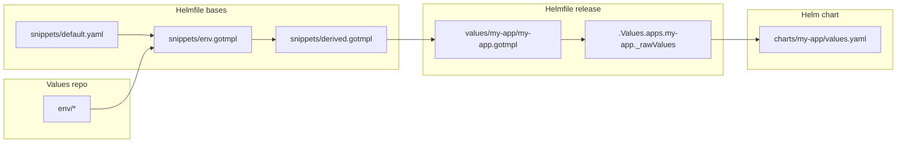

# Navigating through the code

Effective development starts with understanding of the code structure and relationship between defferent components of the system.

# Helmfile

All helmfiles are defined in `helmfile.d/` directory and executed in alpahbetical ordered.
Majority of helmfile have the following structure

```go-template
bases:
  - snippets/defaults.yaml
---
bases:
  - snippets/env.gotmpl
---
bases:
  - snippets/derived.gotmpl
---
{{ readFile "snippets/templates.gotmpl" }}
{{- $v := .Values }}
{{- $a := $v.apps }}

releases:
  - name: my-app
    installed: {{ $a | get "my-app.enabled" }}
    namespace: my-namespace
    <<: *default
```



In the following diagram you can find out what happens after calling `otomi apply -l name=my-app-name`

## Code structure

```
otomi-core
├── .values                     # Boilerplate for initializing git repository
├── adr                         # Architectural Decision Records [read more](https://adr.github.io/madr/)
├── bin                         # Otomi CLI entrypoint (deprecated)
├── binzx                       # Otomi CLI entrypoint
├── chart                       # Helm chart for installing Otomi
├── charts                      # All other Helm charts that comprise Otomi
├── docs                        # Documentation
├── helmfile.d/helmfile-*.yaml  # Helmfile files ordered by name and executed accordigly by otomi apply command
├── helmfile.d/snippets         # Reusable code snippets
├── helmfile.tpl                # Additional Helmfiles that do not have corresponding chartare not executed on otomi apply command
├── k8s                         # Kubernetes manifests that before any other chart
├── policies                    # OPA policies for Gatekeeper
├── src                         # Otomi CLI source code
├── tests                       # Values used for testing purpose
├── upgrades.yaml               # Upgrade presync hooks
├── values                      # Value templates that serves as input to coresponing Helm charts
├── values-changes.yaml         # Definiitons for performing data migrations
├── values-schema.yaml          # JSON schema that defines Otomi interface
└── versions.yaml               # Version tags of otomi-api, otomi-console and otomi-tasks
```

It is important that you get familiar with code snippets, because most of them are reused in many places. Below I describe the most essential ones:

```
otomi-core/helmfile.d/snippets
├── defaults.yaml             # static defaults that can be overwritten by user values and/or derived values
├── derived.gotmpl            # values derived from default and user values
├── env.gotmpl                # define helmfile environment settings
└── templates.gotmpl          # define YAML anchors that are used to define releases in helmfile
```

Code snippets are referenced with []node anchors (e.g.: `<<: *default`). It means that before Helmfile starts processing any release the YAML engine will parse the anchor. Anchors are defined in `helmfile.d/snippets/templates.gotmpl` file (e.g.: `&default`).

# Adding new core application

## Defining realese

TBD

## Adding chart

TBD

## Adding chart artifacts

TBD

## Exposing public endpoints

TBD

## Integration with keycloak

TBD
