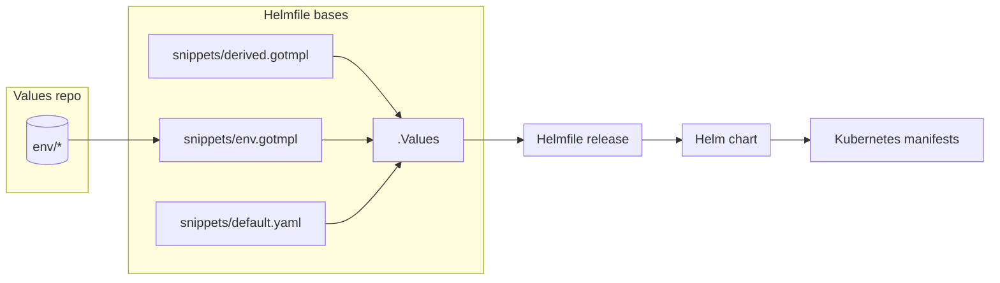
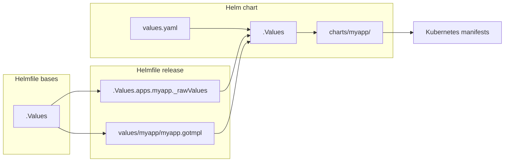
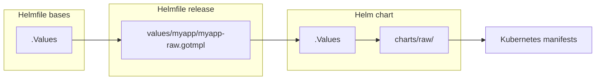
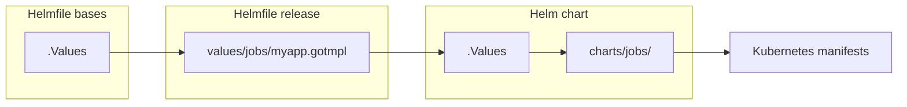

# Code development guide

Effective development starts with an understanding the code structure and the relationship between different components of the system.

# Table of Contents

- [Navigating through code](#Navigating-through-code)
- [Values and data flow](#Values-repo-and-data-flow)
- [Integrating core apps](#Integrating-core-apps)
- [Working with the team-ns chart](#working-with-the-team-ns-chart)
- [Testing](#testing)
- [Otomi CLI](#otomi-cli)
- [Troubleshooting](#troubleshooting)

# Navigating through code

## Project structure

```
otomi-core
├── .values                     # Boilerplate for initializing git repository
├── adr                         # Architectural Decision Records [read more](https://adr.github.io/madr/)
├── bin                         # Otomi CLI entrypoint (deprecated)
├── binzx                       # Otomi CLI entrypoint
├── chart                       # Helm chart for installing Otomi
├── charts                      # All other Helm charts that comprise Otomi
├── docs                        # Documentation
├── helmfile.d/helmfile-*.yaml  # Helmfile specs ordered by name and executed accordingly by otomi commands
├── helmfile.d/snippets         # Reusable code snippets
├── helmfile.tpl                # Additional Helmfiles that do not have corresponding chart and are not parsed on otomi apply|template command
├── k8s                         # Kubernetes manifests that before any other chart
├── policies                    # OPA policies for Gatekeeper
├── src                         # Otomi CLI source code
├── tests                       # Values used for testing purposes
├── upgrades.yaml               # Upgrade presync hooks
├── values                      # Value templates that serves as input to corresponding Helm charts
├── values-changes.yaml         # Definitions for performing data migrations
├── values-schema.yaml          # JSON schema that defines Otomi interface
└── versions.yaml               # Version tags of otomi-api, otomi-console and otomi-tasks
```

## Reusable code snippets

It is important that you get familiar with reusable code snippets located at `helmfile.d/snippets`. Below, I describe the most essential ones:

```
otomi-core/helmfile.d/snippets
├── defaults.yaml             # static defaults that can be overwritten by user values and/or derived values
├── derived.gotmpl            # values derived from default and user values
├── env.gotmpl                # define helmfile environment settings
└── templates.gotmpl          # define YAML aliases that are used to render specs for Helmfile releases
```

## YAML anchors and aliases

Whenever you see `<<: *somename` then it means that [node anchor](<(https://yaml.org/spec/1.2.2/#692-node-anchors)>) is used. In order to find its definition ([node alias](https://yaml.org/spec/1.2.2/#71-alias-nodes)), search for `&somename` string.

# Values repo and data flow

A values repo is provided by a user. If Otomi is a function then `values repo` is input arguments. It is composed of many YAML files containing the configuration for various apps and teams.

While rendering kubernetes manifests Otomi leverages Helmfile.

> Helmfile is a declarative spec for deploying helm charts. You are encouraged to read more about Helmfile at https://github.com/helmfile/helmfile.

In Otomi, all Helmfile specs are defined in the `helmfile.d/` directory and executed in alphabetical order. The majority of Helmfile specs has the following structure:

```go-template
#helmfiled./999-helmfile.yaml
bases:
  - snippets/defaults.yaml
---
bases:
  - snippets/env.gotmpl
---
bases:
  - snippets/derived.gotmpl
{{ readFile "snippets/templates.gotmpl" }}

releases:
  - <helmfile release>
```

From the above code snippet, the `base` statements define loading and merging values from various sources. If we would execute `otomi apply|template -f helmfiled./999-helmfile.yaml` then the following data flow would take place:



From the flow diagram, we can distinguish four stages of data, before `Kubernetes manifests` are rendered. These are: `Values repo`, `Helmfile bases`, `Helmfile release`, and `Helm chart`.

**Values repo**: It contains files that define input parameters for Otomi. This is where you can define teams, team, services, enabled applications and their configurations, etc. A user sets the `$ENV_DIR` env variable, so Otomi knows about its location.

**Helmfile bases**: From the flow diagram, three files incorporate the content of the `.Values` - a Helmfile variable, which is accessible while using Go templates. These files are merged together in the following order: `snippets/default.yaml` -> `snippets/env.gotmpl` -> `snippets/derived.gotmpl`.

**Helmfile release**: At this stage, Helmfile is establishing a path to the Helm chart and the content of the Helm chart values. We will talk more about defining Helmfile releases in the next chapter.

**Helm chart**: Helmile executes Helm and provides a chart and values as input.

**Kubernetes manifests**: Helm generates Kubernetes manifests that can be deployed to the cluster.

Let's zoom into the function of `snippets/defaults.yaml` file. It contains default app values. For example, defining the default value for enabling the app.

The function of the `snippets/derived.gotmpl` file is to derive those values that depend on user input (values repo). For example, you can enable an app only if a certain cluster provider is set.

Almost each Helmfile spec loads `snippets/templates.gotmpl` file, which contains code snippets used to define helmfile releases. You will learn more about them in the [Integrating core apps](#Integrating-core-apps) chapter.

# Validating data from the values repo

Otomi validates all parameters that a user can set in values repo by means checking values against JSON schema defined in the `values-schema.yaml` file. The validation can performed by calling `otomi validate-values` CLI command.

The schema is also a great source of documentation as most of the defined properties have corresponding documentation.

# Integrating core apps

In this chapter, you will learn about defining a new core app. We will also explain what happes under the hood while executing the `otomi apply|diff|template -l name=myapp` CLI command.

After reading this chapter, you should know how to create deployable Helmfile releases.

In the [last chapter](#Values-repo-and-data-flow), you have learned about Helmfile spec and loading `values repo` into Helmfile.

In the [Code structure](#Code-structure) chapter, you have learned about reusable code snippets located in `helmfile.d/snippets/` directory. In this chapter we will present practical examples of using snippets from the `helmfile.d/snippets/templates.gotmpl` file.

> We present `myapp` integration. The `myapp` is an arbitrary name and can be anything else.

> A core apps are those defined in otomi-core. Do not confuse them with team services, which are defined in the values repo.

## Using the default code snippet

If you just want to deploy a simple Helm chart then use the `default` codes snippet. A deployable Helmfile release consists of three elements: `release name`, `helm chart`, and `chart values`.

```go-template
# header with Helmfile bases
---
{{ readFile "snippets/templates.gotmpl" }}
{{- $a := .Values.apps }}

releases:
  - name: myapp
    installed: {{ $a | get "myapp.enabled" }}
    namespace: my-namespace
    <<: *default
```

Let's examine what happens if you call `otomi template -l name=myapp`, by analysing the following flow diagram:



Form the diagram, Helmfile leverages the `myapp` chart located at `charts/myapp/` directory and populates values rendered in the `values/values/myapp.gotmpl` file.

The values are merged in the the following order:
`values.yaml` -> `values/values/myapp.gotmpl` -> `.Values.apps.myapp._rawValues`

> In the `values/values/myapp.gotmpl` file, you can adjust the content of the `.Values` object to the data structure that a given Helm chart requires.

Finally the `_rawValues` allow to overwrite those Helm chart values that are not defined in the `values-schema.yaml` file.

## Adding app artifacts

A given app may need to be accompanied by additional Kubernetes manifests. For example, you want to deploy an operator and custom resource that tell the operator what to do. If that is the case, use the `*raw` anchor to define Helmfile release and deploy additional Kubernetes manifests.

```
# header with Helmfile bases
{{ readFile "snippets/templates.gotmpl" }}
{{- $a := .Values.apps }}
releases:
  - name: myapp-artifacts
    installed: {{ $a | get "myapp.enabled" }}
    namespace: my-namespace
    <<: *raw
```

Let's examine what happens if you call `otomi template -l name=myapp-artifacts`, by analysing the following flow diagram:



Form the diagram, Helmfile leverages the `raw` chart located at `charts/raw/` directory and populates values rendered in the `values/values/myapp-raw.gotmpl` file.

> Whenever the `*raw` anchor is used the release name must contain `-artifacts` postfix.

## Adding maintenance Job or CronJob

Sometimes it is not possible do define every app configuration parameter in a declarative way. If that is the case then you can use the `*jobs` anchor to define Helmfile release for both Kubernetes Job and CronJob and execute tasks that finalize the app configuration.

```
{{ readFile "snippets/templates.gotmpl" }}
{{- $v := .Values }}
{{- $a := $v.apps }}

releases:
  - name: job-myapp
    installed:  {{ $a | get "myapp.enabled" }}
    <<: *jobs
```

Let's examine what happens if you call `otomi template -l name=job-myapp`, by analysing the following flow diagram:



Form the diagram, Helmfile leverages the `jobs` chart located at `charts/jobs/` directory and populates values rendered in the `values/jobs/myapp.gotmpl` file. To learn about defining custom jobs, take a look at the `charts/jobs/values.yaml` file and jobs that are already defined in the `values/charts/jobs/` directory.

> All jobs defined with the `*jobs` code snippet are deployed to the `maintenance` namespace.

## Defining JSON schema

If your app has some parameters that a user should manipulate then make sure you define them in the `values-schema.yaml` file.

## Configuring Namespaces

Otomi defines Kubernetes namespaces and their labels in the `core.yaml` file, at the `k8s.namespaces` property.

## Configuring Ingress

Ingress for admin platform apps is defined in the `core.yaml` file, at the `adminApps` property. Ingress for team platform apps is defined in `core.yaml` at `teamApps` property. To learn more about possible ingress properties take a look at `#/definitions/service` schema in the `values-schema.yaml` file.

## Integrating with keycloak

It is possible to integrate an app with Keycloak, by leveraging the following variables:

```
OIDC_ENDPOINT: {{ .Values._derived.oidcBaseUrl }}
OIDC_CLIENT_ID: {{ .Values.apps.keycloak.idp.clientID  }}
OIDC_CLIENT_SECRET: {{ .Values.apps.keycloak.idp.clientSecret }}
OIDC_GROUPS_CLAIM: groups
OIDC_NAME: keycloak
OIDC_SCOPE: openid
```

To support untrusted certificates you may need to conditionally disable certificate validation:

```
OIDC_VERIFY_CERT: '{{ not $v._derived.untrustedCA }}'
```

Note: you may need to adjust variable names to match the ones expected by a given app.

# Working with the team-ns chart

This chart can produce manifests that define a team environment, like _Ingress_, Istio _VirtualService_, _NetworkPolicy_, _Secrets_, _ExternalSecrets_, _ResourceQuota_, and _Ingress_, team apps, team services settings.

Every team is deployed as a separate Helmfile release, thus targeting a specific team release is performed by adding a team name postfix to the chart name `team-ns`, e.g.:

```
otomi template -l name=team-ns-demo
```

# Otomi CLI

## Developing CLI

TBD

## Using CLI while developing templates

Using Otomi CLI can be very helpful while integrating apps or developing new features that involve the execution of Helmfile because it allows you to render and validate manifests. It is possible to use Otomi CLI in development mode, so the Otomi CLI reflects changes made in your local `otomi-core` directory.

To run Otomi CLI in the development mode, you must:

- execute Otomi CLI commands from a root directory of the `otomi-core` project
- export `ENV_DIR`

First, run `npm install` to build all modules required for CLI.

Then, install other dependencies

```
npm run install-deps
```

To create a values repository, follow the below steps:

1. Indicate the path of the value repo, e.g.:

```
export ENV_DIR=$HOME/otomi-values
```

2. Bootstrap the values repo:

```
otomi bootstrap
```

3. Now open `$ENV_DIR` directory in your favorite IDE. Otomi has bootstrapped the skeleton of the repo with default values.
4. Last but not least provide information about your k8s cluster in `$ENV_DIR/env/cluster.yaml` file. Note, it can be fake data if you are not willing to deploy your changes to the cluster.

```
cluster:
    name: 'dev'
    k8sVersion: '1.24'
    provider: 'custom'
```

5. Ensure that values from `$ENV_DIR` conform with the `values-schema.yaml` schema.

```
otomi validate-values
```

Voila. You have built your values repo and can use it for Otomi development.

Below you can find some useful use cases:

**Rendering otomi values from ENV_DIR**

```

otomi values

```

**Validating values from ENV_DIR**

```

otomi validate-values

```

**Validating all rendered chart templates**

```

otomi validate-templates

```

**Validating rendered chart templates**

```

otomi validate-templates -l name=myapp

```

**Rendering chart values**

```

otomi x helmfile -l name=myapp write-values

```

# Troubleshooting

Some cloud providers are suing custom plugins to refresh the token. Since Otomi CLI executes by default in container some plugins may not be available. In order to solve this issue you can instruct Otomi CLI to execute directly on your host.

First ensure that you have all required binaries

```
npm run install-deps
```

Then instruct Otomi to not run in docker:

```
export IN_DOCKER=1
```

Next you can execute `otomi apply` or `otomi status` against your to connect with your kubernetes cluster.
