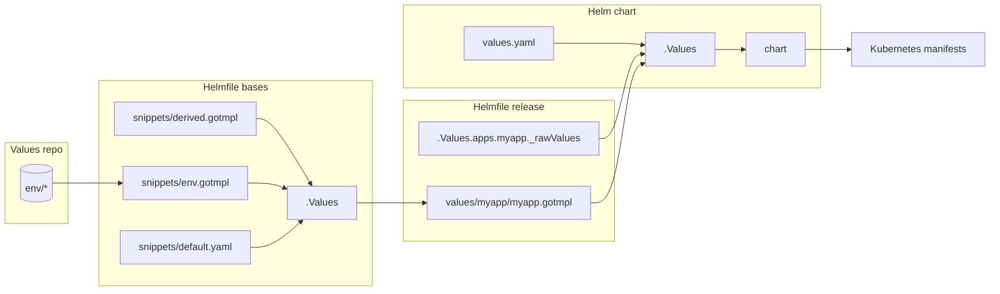

Development guide

Effective development starts with understanding of the code structure and relationship between different components of the system.

# Table of Contents

- [Code structure](#code-structure)
- [Otomi and Helmfile](#otomi-and-helmfile)
- [Values and data flow](#data-flow)
- [Platform apps](#platform-apps)
- [Special charts](#special-charts)
- [Development](#development)

# Code structure

```
otomi-core
├── .values                     # Boilerplate for initializing git repository
├── adr                         # Architectural Decision Records [read more](https://adr.github.io/madr/)
├── bin                         # Otomi CLI entrypoint (deprecated)
├── binzx                       # Otomi CLI entrypoint
├── chart                       # Helm chart for installing Otomi
├── charts                      # All other Helm charts that comprise Otomi
├── docs                        # Documentation
├── helmfile.d/helmfile-*.yaml  # Helmfile files ordered by name and executed accordigly by otomi apply command
├── helmfile.d/snippets         # Reusable code snippets
├── helmfile.tpl                # Additional Helmfiles that do not have corresponding chartare not executed on otomi apply command
├── k8s                         # Kubernetes manifests that before any other chart
├── policies                    # OPA policies for Gatekeeper
├── src                         # Otomi CLI source code
├── tests                       # Values used for testing purpose
├── upgrades.yaml               # Upgrade presync hooks
├── values                      # Value templates that serves as input to coresponing Helm charts
├── values-changes.yaml         # Definiitons for performing data migrations
├── values-schema.yaml          # JSON schema that defines Otomi interface
└── versions.yaml               # Version tags of otomi-api, otomi-console and otomi-tasks
```

It is important that you get familiar with code snippets, because most of them are reused in many places. Below I describe the most essential ones:

```
otomi-core/helmfile.d/snippets
├── defaults.yaml             # static defaults that can be overwritten by user values and/or derived values
├── derived.gotmpl            # values derived from default and user values
├── env.gotmpl                # define helmfile environment settings
└── templates.gotmpl          # define YAML aliases that are used to render specs for Helmfile releases
```

# Otomi and Helmfile

Helmfile is a declarative spec for deploying helm charts. You are encouraged to read more about Helmifle at https://github.com/helmfile/helmfile

In Otomi all Helmfile specs are defined in `helmfile.d/` directory and executed in alphabetical order. Majority of helmfile have the following structure:

```go-template
# helmfile.d/999-helmifle.yaml
bases:
  - snippets/defaults.yaml
---
bases:
  - snippets/env.gotmpl
---
bases:
  - snippets/derived.gotmpl
---
{{ readFile "snippets/templates.gotmpl" }}
{{- $v := .Values }}
{{- $a := $v.apps }}

releases:
  - name: myapp
    installed: {{ $a | get "myapp.enabled" }}
    namespace: my-namespace
    <<: *default
```

From above there are three `bases`, which are merged in the following order `snippets/defaults.yaml`, `snippets/env.gotmpl` and `snippets/derived.gotmpl`.

> Helmfile merges all the "base" state files before processing.

Next, there is one release defined: `myapp`. The release is deployed to the `my-namespace` namespace only if the `apps.myapp.enabled` flag is set. The release references `*default` code snippet, which points to [alias](https://yaml.org/spec/1.2.2/#71-alias-nodes) defined in the `snippets/templates.gotmpl` file.

The `&default` alias defines chart location and values that will be populated to this chart.

# Data flow

Let's examine data flow from values repo to the chart values while user performs `otomi apply|diff|template -l name=myapp` CLI command.



_Values repo_
The values repo contains files that define input paramters for Otomi. This is where you can define teams, team, services, enabled applications and their condgurations, etc. A user sets `$ENV_DIR` env varable, so Otomi knows about its location.

_Helmfile bases_
During execution of the Otomi CLI command Helmfile is triggered. It loads all files from values repo are merges them according to spec defined in the `snippets/env.gotmpl` file. Next, the `snippets/default.yaml`, `snippets/env.gotmpl` and `snippets/derived.gotmpl` files are merged, thus Helmfile `.Values` obtains its ultimate content.

_Helmfile release_
At this stage Helmfile is establishing path to the Helm chart and content of the Helm chart values (`values/myapp/myapp.gotmpl`). A user can also define app values (`_rawValues`) that are not supported by Otomi but are valid input for a given Helm chart.

_Helm chart_
Helmile executes Helm and provides chart and values as input. The default Helm chart `values.yaml` is merged with the values provided from the _Helmfile release_ stage composing `.Values` object that is populated to the chart templates.

Lastly, Helm generate kubernetes manifests that can be deployed to the cluster.

# Platform apps

The platform apps are those defined in otomi-core Do not confuse them with team services, which are defined in values repo.

## Configuring Namespaces

All Kubernetes namespaces are defined in `core.yaml` at `k8s.namespaces` property.

## Configuring Ingress

Ingress for admin platform apps is defined in `core.yaml` at `adminApps` property. Ingress for team platform apps is defined in `core.yaml` at `teamApps` property.

## Integration with keycloak

It is possible to integrate an app with Keycloak, by leveraging the following variables:

```
OIDC_ENDPOINT: {{ .Values._derived.oidcBaseUrl }}
OIDC_CLIENT_ID: {{ .Values.apps.keycloak.idp.clientID  }}
OIDC_CLIENT_SECRET: {{ .Values.apps.keycloak.idp.clientSecret }}
OIDC_GROUPS_CLAIM: groups
OIDC_NAME: keycloak
OIDC_SCOPE: openid
```

In order to support untrusted certificates you may need to conditionally disable certificate validation:

```
OIDC_VERIFY_CERT: '{{ not $v._derived.untrustedCA }}'
```

Note: you may need to adjust variable names to match the ones expected by a given app.

# Special charts

There are few special charts that needs you attention.

## jobs

This chart is used to deploy kubernetes Jobs and CronJobs.
When defining Helfile release you need to anchor the `jobs` alias and add `job-` prefix the release name

```
releases:
  - name: job-myapp
    installed: true
    <<: *jobs
```

All jobs are deplyed to the `maintenance` namespace.
You can define a job spec at: `values/jobs/myapp.gotmpl` file

## team-ns

This chart defines team environment and Ingress settings.
While using otomi you can target a given team by appending its to the release name.

```
./binzx/otomi template -l name=team-ns-<team-name>
```

e.g.:

```
./binzx/otomi template -l name=team-ns-demo
```

You can define job spec in aw manifests in `values/myapp/myapp-raw.gotmpl` file.

## raw

The raw chart lets you wrap raw kubernetes manifest into deployable chart
When defining Helfile release you need to anchor the `raw` alias and add `-artifacts` postfix to the release name

```
releases:
  - name: myapp-artifacts
    installed: true
    namespace: my-namespace
    <<: *raw
```

You can define raw manifests in `values/myapp/myapp-raw.gotmpl` file.

# Development

You can render templates of a given chart and validate it without having any cluster. The easiest way is to start with values from `tests/fixtures` directory.

```
export ENV_DIR=$PWD/tests/fixtures
```

Also instruct otomi to use master container image tag

```
export OTOMI_TAG=master
```

**Rendering otomi values from ENV_DIR**

```
otomi values
```

**Validating values from ENV_DIR**

```
otomi validate-values
```

**Validating all rendered chart templates**

```
otomi validate-templates
```

**Validating rendered chart templates**

```
otomi validate-templates -l name=<release-name>
```

e.g.:

```
otomi validate-templates -l name=nginx-ingress
```

**Rendering chart values**

```
otomi x helmfile -l name=<release-name> write-values
```

e.g.:

```
otomi x helmfile -l name=nginx-ingress write-values
```
