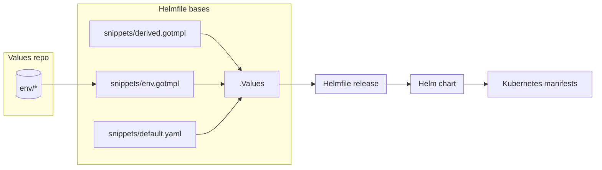
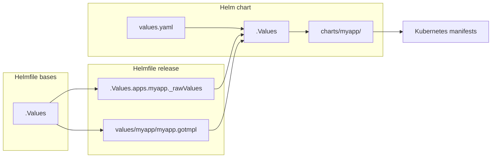
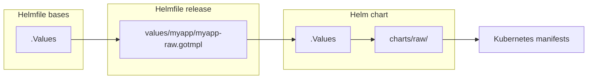
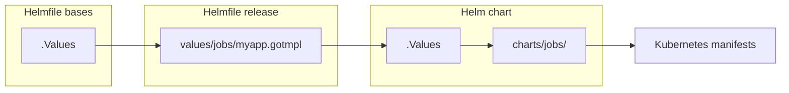

# Development guide

Effective development starts with understanding of the code structure and relationship between different components of the system.

# Table of Contents

- [Navigating through code](#Navigating-through-code)
- [Values and data flow](#Values-repo-and-data-flow)
- [Integrating core apps](#Integrating-core-apps)
- [Working with team-ns chart](#working-with-team-ns-chart)
- [Testing](#testing)
- [Otomi CLI](#otomi-cli)

# Navigating through code

## Project structure

```
otomi-core
├── .values                     # Boilerplate for initializing git repository
├── adr                         # Architectural Decision Records [read more](https://adr.github.io/madr/)
├── bin                         # Otomi CLI entrypoint (deprecated)
├── binzx                       # Otomi CLI entrypoint
├── chart                       # Helm chart for installing Otomi
├── charts                      # All other Helm charts that comprise Otomi
├── docs                        # Documentation
├── helmfile.d/helmfile-*.yaml  # Helmfile specs ordered by name and executed accordingly by otomi commands
├── helmfile.d/snippets         # Reusable code snippets
├── helmfile.tpl                # Additional Helmfiles that do not have corresponding chartare not executed on otomi apply command
├── k8s                         # Kubernetes manifests that before any other chart
├── policies                    # OPA policies for Gatekeeper
├── src                         # Otomi CLI source code
├── tests                       # Values used for testing purpose
├── upgrades.yaml               # Upgrade presync hooks
├── values                      # Value templates that serves as input to corresponding Helm charts
├── values-changes.yaml         # Definitions for performing data migrations
├── values-schema.yaml          # JSON schema that defines Otomi interface
└── versions.yaml               # Version tags of otomi-api, otomi-console and otomi-tasks
```

## Reusable code snippets

It is important that you get familiar with reusable code snippets located at `helmfile.d/snippets` Below, I describe the most essential ones:

```
otomi-core/helmfile.d/snippets
├── defaults.yaml             # static defaults that can be overwritten by user values and/or derived values
├── derived.gotmpl            # values derived from default and user values
├── env.gotmpl                # define helmfile environment settings
└── templates.gotmpl          # define YAML aliases that are used to render specs for Helmfile releases
```

## YAML anchors and aliases

Whenever you see `<<: *somename` then it means that [node anchor](<(https://yaml.org/spec/1.2.2/#692-node-anchors)>) is used. In order to find its definition ([node alias](https://yaml.org/spec/1.2.2/#71-alias-nodes)), search for `&somename` string.

# Values repo and data flow

A values repo is provided by a user. If Otomi is a function then `values repo` is input arguments. It is composed by many YAML files containing configuraiton of various apps and teams.

When Otomi executes Helmfile it instructs to load a spec from `helmfile.d/` directory. Each Helmfile spec consists of header that is presented in the code snippet below.

> Helmfile is a declarative spec for deploying helm charts. You are encouraged to read more about Helmfile at https://github.com/helmfile/helmfile.

In Otomi all Helmfile specs are defined in `helmfile.d/` directory and executed in alphabetical order. Majority of helmfile have the following structure:

```go-template
bases:
  - snippets/defaults.yaml
---
bases:
  - snippets/env.gotmpl
---
bases:
  - snippets/derived.gotmpl
{{ readFile "snippets/templates.gotmpl" }}

releases:
  - <helmfile release>
---
```

The above the `base` statements define loading and merging values from various sources By translating that Helmfile spec results in the following flow diagram:



From the flow diagram,there are three files that incorporate to the content of the `.Values` Helmfile variable, which is accesisble whule using Go templating. These files are merged together in the following order: `snippets/default.yaml` -> `snippets/env.gotmpl` -> `snippets/derived.gotmpl`.

_Values repo_: The values repo contains files that define input paramters for Otomi. This is where you can define teams, team, services, enabled applications and their configurations, etc. A user sets `$ENV_DIR` env varable, so Otomi knows about its location.

_Helmfile bases_: During execution of the Otomi CLI command Helmfile is triggered. It loads all files from values repo are merges them according to spec defined in the `snippets/env.gotmpl` file. Next, all three files are merged together in the following order: `snippets/default.yaml` -> `snippets/env.gotmpl` -> `snippets/derived.gotmpl`, thus Helmfile `.Values` obtains its ultimate content.

_Helmfile release_
At this stage Helmfile is establishing path to the Helm chart and content of the Helm chart values. We will talk more about defining Helmfile releases in next chapter

_Helm chart_
Helmile executes Helm and provides chart and values as input.

_Kubernetes manifests_: Helm generate kubernetes manifests that can be deployed to the cluster.

Let's zoom into the function of `snippets/defaults.yaml` file. It contains default app values. For example, defining default value of app enabled flag.

The function of the `snippets/derived.gotmpl` file is to derive those values that depends on user input (values repo). For example you can enable an app only if certain cluster provider is set.

Almost each loads `snippets/templates.gotmpl` file, which contains code snippets used to define helmfile releases.

# Integrating core apps

In this chapter you will learn about definining a new core app. We will also and examine data flow diagrams that correspond to execution of `otomi apply|diff|template -l name=myapp` CLI command.

After reading this chapter you should now how to create a deployable Helmfile release.

In the [last chapter](#Values-repo-and-data-flow) you have learned about Helmfile spec and about loading `values repo` into Helmfile.

In the [Code structure](#Code-structure) chapter you have learned about reusable code snippets located in `helmfile.d/snippets/` directory. In this chapter we will present practical examples of usning snippets from the `helmfile.d/snippets/templates.gotmpl` file.

> We present `myapp` integration. The `myapp` is an arbitrary name and can be anything else.

> A core apps are those defined in otomi-core. Do not confuse them with team services, which are defined in values repo.

## Using default code snippet

A deployable Helmfile release consits of three elements: `release name`, `helm chart`, and `chart values`. If you just want to deploy a simple Helm chart then use `default` codes snippet.

```go-template
# header with Helmfile bases
---
{{ readFile "snippets/templates.gotmpl" }}
{{- $a := .Values.apps }}

releases:
  - name: myapp
    installed: {{ $a | get "myapp.enabled" }}
    namespace: my-namespace
    <<: *default
```



## Adding app artifacts

It may happens that a given app needs to be accompanied with additional Kuberentes manifests.
For example you want to deploy an operator and custom resource that tell the operator what to do. It that is the case, use `*raw` anchor to define Helmfile release.

```
# header with Helmfile bases
{{ readFile "snippets/templates.gotmpl" }}
{{- $a := .Values.apps }}
releases:
  - name: myapp-artifacts
    installed: {{ $a | get "myapp.enabled" }}
    namespace: my-namespace
    <<: *raw
```



**Note:** whenever the `*raw` anchor is used the release name must contain `-artifacts` postfix.

## Adding maintenance Job or CronJob

Sometimes it is not possible do define every app configuration parameter in a declarative way. It that is the case then you can use `*jobs` anchor to define Helmfile release for both kubernetes Job and CronJob.

```
{{ readFile "snippets/templates.gotmpl" }}
{{- $v := .Values }}
{{- $a := $v.apps }}

releases:
  - name: job-myapp
    installed:  {{ $a | get "myapp.enabled" }}
    <<: *jobs
```

The above helmfile release results in the following flow diagram:



Form the diagram the Helmfile loads chart located at `charts/jobs/` directory and populates values rendered in the `values/jobs/myapp.gotmpl` file. In order to learn about defining custom jobs, take a look at `charts/jobs/values.yaml` file and jobs that are already defined in `values/charts/jobs/` directory.

**Note:** all jobs defined with `*jobs` code snippet are deployed to the `maintenance` namespace.

## Configuring Namespaces

All Kubernetes namespaces are defined in `core.yaml` at `k8s.namespaces` property.

## Configuring Ingress

Ingress for admin platform apps is defined in `core.yaml` at `adminApps` property. Ingress for team platform apps is defined in `core.yaml` at `teamApps` property.

## Integrating with keycloak

It is possible to integrate an app with Keycloak, by leveraging the following variables:

```
OIDC_ENDPOINT: {{ .Values._derived.oidcBaseUrl }}
OIDC_CLIENT_ID: {{ .Values.apps.keycloak.idp.clientID  }}
OIDC_CLIENT_SECRET: {{ .Values.apps.keycloak.idp.clientSecret }}
OIDC_GROUPS_CLAIM: groups
OIDC_NAME: keycloak
OIDC_SCOPE: openid
```

In order to support untrusted certificates you may need to conditionally disable certificate validation:

```
OIDC_VERIFY_CERT: '{{ not $v._derived.untrustedCA }}'
```

Note: you may need to adjust variable names to match the ones expected by a given app.

# Working with team-ns chart

This chart defines team environment and Ingress settings.
While using otomi you can target a given team by appending its to the release name.

```
./binzx/otomi template -l name=team-ns-<team-name>
```

e.g.:

```
./binzx/otomi template -l name=team-ns-demo
```

# Testing

## Smoke testing

The values repo for smoke tests is located at `tests/fixtures` directory

## Validating against policies

# Otomi CLI

## Developing CLI

## Using CLI while developing templates

You can render templates of a given chart and validate it without having any cluster. The easiest way is to start with values from `tests/fixtures` directory.

```
export ENV_DIR=$PWD/tests/fixtures
```

Also instruct otomi to use master container image tag

```
export OTOMI_TAG=master
```

**Rendering otomi values from ENV_DIR**

```
otomi values
```

**Validating values from ENV_DIR**

```
otomi validate-values
```

**Validating all rendered chart templates**

```
otomi validate-templates
```

**Validating rendered chart templates**

```
otomi validate-templates -l name=<release-name>
```

e.g.:

```
otomi validate-templates -l name=nginx-ingress
```

**Rendering chart values**

```
otomi x helmfile -l name=<release-name> write-values
```

e.g.:

```
otomi x helmfile -l name=nginx-ingress write-values
```
