# APL Operator Execution Flow

This document provides a comprehensive overview of the APL Operator's execution flow, including installation and GitOps operations.

## Overview

The APL Operator runs in two distinct phases:

1. **Phase 1: Installation** - Reconciliation loop that installs the platform until successful
2. **Phase 2: GitOps Operations** - Two parallel loops that monitor Git changes and periodically reconcile state

## Sequence Diagram

```mermaid
sequenceDiagram
    autonumber

    participant Main as main.ts
    participant Installer as Installer
    participant AplOps as AplOperations
    participant Bootstrap as bootstrap()
    participant Install as install()
    participant K8s as Kubernetes API
    participant Git as Git Repository
    participant Helmfile as Helmfile
    participant Operator as AplOperator
    participant GitRepo as GitRepository
    participant Poll as Poll Loop
    participant Reconcile as Reconcile Loop

    %% ============================================================
    %% PHASE 1: INSTALLATION
    %% ============================================================

    Note over Main,K8s: PHASE 1: INSTALLATION

    Main->>Main: Create ENV_DIR directories
    Main->>AplOps: new AplOperations()
    Main->>Installer: new Installer(aplOps)

    Main->>Installer: reconcileInstall()

    Note over Installer,K8s: Retry Loop: while(true)

    Installer->>Installer: attemptNumber++

    loop Until Success
            Installer->>AplOps: validateCluster()
            AplOps-->>Installer: cluster validated

            Installer->>AplOps: bootstrap()
            AplOps->>Bootstrap: bootstrapModule.handler({})

            Bootstrap->>Bootstrap: copyBasicFiles()
            Note right of Bootstrap: Copy bin, vscode config,<br/>values-schema.yaml

            Bootstrap->>Bootstrap: migrate()
            Note right of Bootstrap: Migrate values to<br/>latest schema

            Bootstrap->>Bootstrap: processValues()
            Bootstrap->>K8s: getK8sSecret('deployment-passwords')
            K8s-->>Bootstrap: existing secrets or null
            Bootstrap->>Bootstrap: generateSecrets()
            Bootstrap->>Bootstrap: createCustomCA()
            Bootstrap->>Bootstrap: getKmsValues()
            Note right of Bootstrap: Generate age keys<br/>if needed
            Bootstrap->>Bootstrap: getUsers()
            Note right of Bootstrap: Add platform admin<br/>with initial password
            Bootstrap->>Bootstrap: writeValues(merged)
            Bootstrap->>K8s: createK8sSecret('deployment-passwords')
            K8s-->>Bootstrap: secret created

            Bootstrap->>Bootstrap: handleFileEntry()
            Bootstrap->>Bootstrap: bootstrapSops()
            Bootstrap->>Bootstrap: encrypt()
            Bootstrap->>Bootstrap: decrypt()
            Bootstrap->>Bootstrap: ensureTeamGitOpsDirectories()
            Bootstrap-->>AplOps: bootstrap complete
            AplOps-->>Installer: bootstrap complete

            Installer->>Installer: getInstallationStatus()
            Installer->>K8s: getK8sConfigMap('apl-installation-status')
            K8s-->>Installer: status or null

            alt status === 'completed'
                Note over Installer: Installation already done,<br/>skip install steps
                Installer-->>Main: return
            else status !== 'completed'
                Installer->>Installer: updateInstallationStatus('in-progress', attemptNumber)
                Installer->>K8s: createUpdateConfigMap('apl-installation-status')
                K8s-->>Installer: ConfigMap updated

                Installer->>AplOps: install()
                AplOps->>Install: installModule.handler({})

                Install->>Install: getDeploymentState()
                Install->>K8s: getK8sConfigMap('deployment-status')
                K8s-->>Install: current state

                Install->>Install: setDeploymentState('deploying')
                Install->>K8s: createUpdateConfigMap('deployment-status')
                K8s-->>Install: state updated

                Install->>Install: deployEssential()
                Install->>Helmfile: hf('helmfile-init.yaml.gotmpl', 'template')
                Helmfile-->>Install: templated manifests
                Install->>K8s: kubectl apply --server-side
                K8s-->>Install: essential resources applied

                Install->>K8s: kubectl apply -f charts/.../crds
                K8s-->>Install: CRDs applied

                Install->>Helmfile: hf(label='stage=prep', 'sync')
                Note right of Install: HF_DEFAULT_SYNC_ARGS:<br/>['sync', '--concurrency=1',<br/>'--reuse-values']
                Helmfile-->>Install: prep charts deployed

                Install->>Helmfile: hf(label='app=core', 'sync')
                Helmfile-->>Install: core apps deployed

                Install->>Install: commit(true)
                Install->>Git: git add, commit, push
                Git-->>Install: changes committed

                Install->>Install: initialSetupData()
                Install->>K8s: createUpdateGenericSecret('platform-admin-credentials')
                K8s-->>Install: secret created

                Install->>K8s: createUpdateConfigMap('welcome')
                K8s-->>Install: welcome message created

                Install->>Install: setDeploymentState('deployed')
                Install->>K8s: createUpdateConfigMap('deployment-status')
                K8s-->>Install: state updated

                Install-->>AplOps: installation complete
                AplOps-->>Installer: installation complete

                Installer->>Installer: updateInstallationStatus('completed', attemptNumber)
                Installer->>K8s: createUpdateConfigMap('apl-installation-status')
                K8s-->>Installer: status updated

                Installer-->>Main: Installation succeeded
            end
    end

    Note over Installer,K8s: On Error: Update status to 'failed',<br/>wait 1 second, retry

    Main->>Installer: setEnvAndCreateSecrets()
    Installer->>Helmfile: hfValues()
    Helmfile-->>Installer: all computed values
    Installer->>Installer: Extract gitea credentials & SOPS key
    Installer->>K8s: createUpdateGenericSecret('gitea-credentials')
    K8s-->>Installer: credentials stored
    Installer->>Installer: Set process.env variables
    Installer-->>Main: { username, password }

    %% ============================================================
    %% PHASE 2: GITOPS OPERATIONS
    %% ============================================================

    Note over Main,Reconcile: PHASE 2: GITOPS OPERATIONS

    Main->>Main: loadConfig(aplOps, gitCredentials)
    Main->>GitRepo: new GitRepository(config)
    GitRepo->>GitRepo: Construct repoUrl with credentials
    GitRepo-->>Main: gitRepository instance

    Main->>Operator: new AplOperator(config)
    Operator-->>Main: operator instance

    Main->>Operator: start()

    Operator->>Operator: isRunning = true
    Operator->>K8s: waitTillGitRepoAvailable(repoUrl)
    loop Retry until available
        K8s->>Git: git ls-remote ${repoUrl}
        Git-->>K8s: repository accessible
    end
    K8s-->>Operator: repository available

    Operator->>GitRepo: clone()
    GitRepo->>Git: git.clone(repoUrl, repoPath)
    Git-->>GitRepo: repository cloned
    GitRepo-->>Operator: clone complete

    Operator->>GitRepo: waitForCommits()
    loop Until commits exist
        GitRepo->>Git: git.pull('origin', 'main')
        Git-->>GitRepo: pulled
        GitRepo->>GitRepo: setLastRevision()
        GitRepo->>Git: git.log({ maxCount: 1 })
        Git-->>GitRepo: latest commit hash
    end
    GitRepo-->>Operator: commits available

    Operator->>Operator: Start parallel loops

    par Poll Loop (every POLL_INTERVAL_MS)
        Operator->>Poll: pollAndApplyGitChanges()

        loop While isRunning
            Poll->>Poll: Check if isApplying

            alt isApplying === true
                Poll->>Poll: Skip this iteration
                Poll->>Poll: Wait POLL_INTERVAL_MS
            else isApplying === false
                Poll->>GitRepo: syncAndAnalyzeChanges()

                GitRepo->>GitRepo: Store previousRevision
                GitRepo->>Git: git.clean('f', ['-X'])
                Git-->>GitRepo: untracked files removed
                GitRepo->>Git: git.pull('origin', 'main')
                Git-->>GitRepo: pulled latest

                GitRepo->>GitRepo: getCurrentRevision()
                GitRepo->>Git: git.log({ maxCount: 1 })
                Git-->>GitRepo: newRevision hash

                alt newRevision === previousRevision
                    GitRepo-->>Poll: { hasChangesToApply: false }
                else First time (no previousRevision)
                    GitRepo->>GitRepo: Update _lastRevision
                    GitRepo-->>Poll: { hasChangesToApply: true, applyTeamsOnly: false }
                else New changes detected
                    GitRepo->>GitRepo: shouldSkipCommits(prev, 'HEAD')
                    GitRepo->>Git: git.log({ from: prev, to: 'HEAD' })
                    Git-->>GitRepo: commit messages

                    alt All commits contain '[ci skip]'
                        GitRepo-->>Poll: { hasChangesToApply: false }
                    else Some commits need apply
                        GitRepo->>GitRepo: getChangedFiles(prev, new)
                        GitRepo->>Git: git.diff(['prev..new', '--name-only'])
                        Git-->>GitRepo: list of changed files

                        GitRepo->>GitRepo: isTeamsOnlyChange(files)
                        Note right of GitRepo: Check if all files<br/>start with 'env/teams/'<br/>or 'teams/'

                        alt Only team files changed
                            GitRepo-->>Poll: { hasChangesToApply: true, applyTeamsOnly: true }
                        else Other files changed
                            GitRepo-->>Poll: { hasChangesToApply: true, applyTeamsOnly: false }
                        end
                    end
                end

                alt hasChangesToApply === true
                    Poll->>Operator: runApplyIfNotBusy(ApplyTrigger.Poll, applyTeamsOnly)
                    Note over Operator,K8s: See "Apply Process" below
                end

                Poll->>Poll: Wait POLL_INTERVAL_MS
            end
        end
    and Reconcile Loop (every RECONCILE_INTERVAL_MS)
        Operator->>Reconcile: reconcile()

        loop While isRunning
            Reconcile->>Operator: runApplyIfNotBusy(ApplyTrigger.Reconcile, false)
            Note over Operator,K8s: See "Apply Process" below

            Reconcile->>Reconcile: Wait RECONCILE_INTERVAL_MS
        end
    end

    %% ============================================================
    %% APPLY PROCESS (Shared by Poll and Reconcile)
    %% ============================================================

    Note over Operator,Helmfile: APPLY PROCESS (runApplyIfNotBusy)

    Operator->>Operator: Check if isApplying

    alt isApplying === true
        Operator->>Operator: Skip, already applying
    else isApplying === false
            Operator->>Operator: isApplying = true (acquire lock)

            Operator->>Operator: Get commitHash from gitRepo.lastRevision
            Operator->>K8s: updateApplyState('in-progress')
            Operator->>K8s: createUpdateConfigMap('apl-operator-state')
            K8s-->>Operator: state updated

            Operator->>Helmfile: hfValues({ defaultValues: true })
            Helmfile-->>Operator: default values
            Operator->>Operator: writeValues(defaultValues)

            alt trigger === ApplyTrigger.Poll
                Operator->>AplOps: migrate()
                AplOps-->>Operator: values migrated

                Operator->>AplOps: validateValues()
                AplOps->>Helmfile: hfValues({ filesOnly: true })
                Helmfile-->>AplOps: values
                AplOps->>AplOps: Load values-schema.yaml
                AplOps->>AplOps: Validate with Ajv
                AplOps-->>Operator: validation passed
            else trigger === ApplyTrigger.Reconcile
                Operator->>Operator: decrypt()
                Note right of Operator: Decrypt SOPS files
            end

            Operator->>Helmfile: hfValues({})
            Helmfile-->>Operator: all values
            Operator->>Operator: ensureTeamGitOpsDirectories()

            Operator->>Operator: commit(false, {})
            Operator->>AplOps: validateValues()
            AplOps-->>Operator: validated
            Operator->>Helmfile: hfValues()
            Helmfile-->>Operator: values with repo config
            Operator->>Git: git config user.name & user.email
            Git-->>Operator: identity set
            Operator->>Git: git remote set-url origin
            Git-->>Operator: remote updated
            Operator->>Operator: encrypt()
            Operator->>Git: commitAndPush(values, branch)
            Git->>Git: git add -A
            Git->>Git: git commit -m "updated values [ci skip]"
            Git->>Git: Check if remote branch exists
            Git->>Git: git checkout -B ${branch}

            loop Retry up to 20 times
                alt Remote branch exists
                    Git->>Git: git pull --rebase origin ${branch}
                end
                Git->>Git: git push -u origin ${branch}

                alt Merge conflict detected
                    Git->>Git: git merge --abort
                    Git->>Git: git rebase --abort
                    Git->>Git: git reset --hard HEAD~1
                    Note right of Git: Return without error,<br/>let reconciliation retry
                    Git-->>Operator: pushed (or conflict resolved)
                else Other error
                    Note right of Git: Retry push
                end
            end
            Git-->>Operator: changes committed & pushed

            alt applyTeamsOnly === true
                Operator->>AplOps: applyTeams()
                AplOps->>Helmfile: deployEssential(['team=true'], force=true)
                Helmfile->>Helmfile: Template helmfile-init with label='team=true'
                Helmfile->>K8s: kubectl apply --server-side --force-conflicts
                K8s-->>Helmfile: team resources applied
                Helmfile-->>AplOps: teams applied
                AplOps-->>Operator: teams applied

                Operator->>AplOps: applyAsAppsTeams()
                AplOps->>AplOps: Create ArgoCD Applications for teams
                AplOps-->>Operator: team apps created
            else applyTeamsOnly === false (Full Apply)
                Operator->>AplOps: apply()
                AplOps->>AplOps: runtimeUpgrade({ when: 'pre' })

                AplOps->>AplOps: setDeploymentState('deploying')
                AplOps->>K8s: createUpdateConfigMap('deployment-status')
                K8s-->>AplOps: state updated

                AplOps->>AplOps: applyTeams()
                Note right of AplOps: Same as teams-only path

                AplOps->>AplOps: applyAsApps({ tekton: true })
                Note right of AplOps: Create ArgoCD Applications<br/>for all platform apps

                AplOps->>AplOps: runtimeUpgrade({ when: 'post' })

                AplOps->>AplOps: commit(false)
                Note right of AplOps: Commit final state

                AplOps->>AplOps: setDeploymentState('deployed')
                AplOps->>K8s: createUpdateConfigMap('deployment-status')
                K8s-->>AplOps: state updated

                AplOps-->>Operator: full apply complete
            end

            Operator->>K8s: updateApplyState('succeeded')
            Operator->>K8s: createUpdateConfigMap('apl-operator-state')
            K8s-->>Operator: state updated

        Operator->>Operator: isApplying = false (release lock)
    end

    Note over Operator,K8s: On Apply Error:<br/>updateApplyState('failed') with errorMessage<br/>isApplying = false
```



## Key Components

### Phase 1: Installation

The installation phase runs in a retry loop until successful:

1. **validateCluster()** - Validates cluster meets prerequisites
2. **bootstrap()** - Sets up the platform environment
   - Copies files (bin, vscode config, schemas)
   - Migrates values to latest schema
   - Processes values (generates secrets, CA, users)
   - Stores secrets in K8s
   - Sets up SOPS encryption
   - Creates team GitOps directories
3. **getInstallationStatus()** - Checks if already installed
4. **install()** - Deploys the platform
   - Deploys essential manifests (server-side apply)
   - Applies CRDs
   - Syncs prep stage charts
   - Syncs core app charts
   - Commits changes to Git
   - Creates welcome ConfigMap
5. **setEnvAndCreateSecrets()** - Extracts and stores credentials

**Retry Logic:**

- On any error, updates status to 'failed' with error message
- Waits 1 second
- Retries from the beginning
- Continues until 'completed' status is reached

### Phase 2: GitOps Operations

Two parallel infinite loops run concurrently:

#### Poll Loop (Git Change Detection)

- **Frequency:** Every `POLL_INTERVAL_MS` (e.g., 30 seconds)
- **Purpose:** Detect and apply Git repository changes
- **Smart Optimization:**
  - Skips iteration if apply is already running
  - Skips commits with `[ci skip]` marker
  - Detects teams-only changes for lightweight apply
- **Process:**
  1. Pull latest from Git
  2. Compare with previous revision
  3. Check if commits should be skipped
  4. Analyze changed files
  5. Trigger apply (teams-only or full) if needed

#### Reconcile Loop (Scheduled Apply)

- **Frequency:** Every `RECONCILE_INTERVAL_MS` (e.g., 5 minutes)
- **Purpose:** Periodic reconciliation to ensure desired state
- **Process:**
  1. Always triggers full apply (not teams-only)
  2. Decrypts SOPS-encrypted files
  3. Runs complete apply process

### Apply Process

Shared by both loops with trigger-specific variations:

**Common Steps:**

1. Acquire lock (`isApplying = true`)
2. Update apply state to 'in-progress'
3. Write default values to Git repo

**Poll-Specific:**

- Migrate values
- Validate values

**Reconcile-Specific:**

- Decrypt SOPS files

**Continuation:** 4. Ensure team GitOps directories 5. Commit changes (with encryption) 6. Push to Git with conflict resolution 7. Apply changes:

- **Teams-Only:** Deploy team resources + ArgoCD apps
- **Full Apply:** Pre-upgrade hooks → Deploy teams → Deploy all apps → Post-upgrade hooks

8. Update apply state to 'succeeded' or 'failed'
9. Release lock (`isApplying = false`)

## Kubernetes Resources

### ConfigMaps

| Name                      | Namespace    | Purpose                          | Fields                                                |
| ------------------------- | ------------ | -------------------------------- | ----------------------------------------------------- |
| `apl-installation-status` | apl-operator | Track installation progress      | status, attempt, timestamp, error?                    |
| `apl-operator-state`      | apl-operator | Track apply operations           | commitHash, status, timestamp, trigger, errorMessage? |
| `welcome`                 | apl-operator | Welcome message with credentials | message, consoleUrl, secretName, secretNamespace      |
| `deployment-status`       | otomi        | Deployment state tracking        | status, tag, version, deployingTag, deployingVersion  |

### Secrets

| Name                         | Namespace    | Purpose               | Fields                     |
| ---------------------------- | ------------ | --------------------- | -------------------------- |
| `gitea-credentials`          | apl-operator | Git repository access | GIT_USERNAME, GIT_PASSWORD |
| `platform-admin-credentials` | keycloak     | Platform admin access | username, password         |
| `deployment-passwords`       | otomi        | All generated secrets | (various)                  |

## Apply Trigger Comparison

| Aspect           | Poll                          | Reconcile          |
| ---------------- | ----------------------------- | ------------------ |
| **Frequency**    | Every ~30s                    | Every ~5m          |
| **Condition**    | Git changes detected          | Always (scheduled) |
| **Skip Logic**   | Yes (`[ci skip]`, no changes) | No                 |
| **Concurrency**  | Skips if applying             | Waits if applying  |
| **Operations**   | Migrate → Validate            | Decrypt            |
| **Apply Type**   | Teams-only or Full            | Always Full        |
| **Optimization** | Smart (file-based)            | None               |

## Error Handling

### Installation Phase

- Catches all errors in reconcileInstall loop
- Updates status to 'failed' with error message
- Waits 1 second (fixed delay)
- Retries indefinitely until success

### GitOps Phase

- Poll loop logs errors and continues
- Reconcile loop logs errors and continues
- Apply process updates state to 'failed' with error message
- Both loops continue running on error

### Git Conflict Resolution

- Detects merge conflicts during push
- Aborts merge/rebase operations
- Resets to previous state
- Returns without error (lets reconciliation retry)

## Concurrency Control

### Apply Lock (`isApplying`)

- Ensures only one apply runs at a time
- Prevents race conditions between poll and reconcile
- Poll loop skips iteration if locked
- Reconcile loop waits via same mechanism
- Released in finally block to guarantee cleanup

### Installation vs GitOps

- Installation must complete before GitOps starts
- No concurrency between phases
- Sequential execution ensures clean startup

## Performance Optimizations

1. **Teams-Only Detection:** When only team files change, runs lightweight apply
2. **Skip Marker:** Commits with `[ci skip]` are ignored by poll loop
3. **Reuse Values:** Helmfile uses `--reuse-values` flag for idempotent upgrades
4. **Concurrency Control:** Prevents redundant applies
5. **Server-Side Apply:** Uses K8s server-side apply for better conflict resolution
6. **Retry with Backoff:** Git operations retry with configurable backoff

## State Transitions

### Installation State Machine

```
pending → in-progress → completed
             ↓ (on error)
          failed → (wait 1s) → in-progress
```

### Apply State Machine

```
idle → in-progress → succeeded → idle
          ↓ (on error)
       failed → idle
```

### Deployment State Machine

```
unknown → deploying → deployed
             ↓ (on error)
          deploying → (retry via reconcile)
```
