# APL Operator Execution Flow

This document describes the complete execution flow of the APL Operator, from initial installation through continuous reconciliation.

## Overview

The operator follows a three-phase startup process:
1. **Installation & Bootstrap** - Installs the platform and prepares the environment
2. **Extract Credentials** - Gets Git credentials from installed components
3. **Start Operator** - Begins continuous reconciliation loops

## Execution Flow Diagram

```mermaid
sequenceDiagram
    participant Main as main()
    participant Installer as Installer
    participant AplOps as AplOperations
    participant Operator as AplOperator
    participant GitRepo as GitRepository
    participant K8s as Kubernetes

    Note over Main: PHASE 1: Installation & Bootstrap

    Main->>Installer: reconcileInstall()

    Note over Installer,K8s: Infinite Retry Loop (1 second backoff)

    Installer->>AplOps: validateCluster()
    AplOps->>K8s: kubectl version
    Note over AplOps: ✓ Validate K8s version

    Installer->>AplOps: bootstrap()
    Note over AplOps: BOOTSTRAP - Runs on every startup!
    AplOps->>AplOps: copyBasicFiles()
    AplOps->>AplOps: migrate()
    AplOps->>AplOps: processValues()
    Note over AplOps: - hfValues() [VALUES LOAD #1]<br/>- generateSecrets()<br/>- validateValues()<br/>- decrypt()<br/>- writeValues()
    AplOps->>AplOps: bootstrapSops()
    AplOps->>AplOps: ensureTeamGitOpsDirectories()

    Installer->>K8s: getInstallationStatus()
    K8s-->>Installer: ConfigMap status

    alt Installation Already Completed
        Note over Installer: Status: "completed"
        Installer->>Main: return (skip install)
        Note over Installer: ✅ Bootstrap ran, skip to Phase 2
    else Installation Needed
        Note over Installer: Status: "pending" or "failed"
        Installer->>K8s: updateInstallationStatus('in-progress')

        Installer->>AplOps: install()
        AplOps->>AplOps: prepareEnvironment()
        Note over AplOps: - decrypt()
        AplOps->>K8s: deployEssential()
        Note over K8s: Essential manifests
        AplOps->>K8s: applyServerSide() CRDs
        Note over K8s: Prometheus & Tekton CRDs
        AplOps->>K8s: hf() stage=prep
        Note over K8s: Init charts
        AplOps->>K8s: hf() app=core
        Note over K8s: Core applications
        AplOps->>AplOps: commit(true)
        AplOps->>AplOps: cloneOtomiChartsInGitea()
        AplOps->>K8s: createCredentialsSecret()
        AplOps->>K8s: hf() pkg=apl-operator
        Note over K8s: Deploy operator
        AplOps->>K8s: createWelcomeConfigMap()

        Installer->>K8s: updateInstallationStatus('completed')
        Installer->>Main: return
        Note over Installer: ✅ Installation complete!
    end

    alt Bootstrap or Install Fails
        Note over Installer: ❌ Exception caught
        Installer->>K8s: updateInstallationStatus('failed')
        Installer->>Installer: Wait 1 second
        Note over Installer: Loop continues...
    end

    Note over Main: PHASE 2: Extract Credentials

    Main->>Installer: setEnvAndCreateSecrets()
    Installer->>AplOps: hfValues()
    Note over AplOps: Load values to extract credentials
    Installer->>Installer: Extract git credentials
    Installer->>K8s: createUpdateGenericSecret()
    Note over K8s: gitea-credentials secret
    Installer->>Installer: Set process.env
    Note over Installer: GIT_USERNAME, GIT_PASSWORD,<br/>SOPS_AGE_KEY, CI
    Installer-->>Main: return gitCredentials

    Note over Main: PHASE 3: Start Operator

    Main->>Operator: start()

    Operator->>Operator: waitTillGitRepoAvailable()
    loop Poll until Gitea available
        Operator->>K8s: Check Gitea endpoint
    end
    Note over Operator: ✓ Gitea is ready

    Operator->>GitRepo: clone()
    Note over GitRepo: Clone repo if not exists

    Operator->>GitRepo: waitForCommits()
    GitRepo->>GitRepo: git pull
    GitRepo->>GitRepo: Set last revision

    Note over Operator: ✅ Operator started successfully!

    Note over Main: PHASE 4: Continuous Reconciliation

    par Reconciliation Loop
        loop Every RECONCILE_INTERVAL_MS
            Operator->>Operator: reconcile()
            Operator->>Operator: runApplyIfNotBusy(Reconcile)

            alt Not Busy
                Operator->>AplOps: hfValues(defaultValues)
                Operator->>AplOps: writeValues()
                Operator->>AplOps: decrypt()
                Operator->>AplOps: hfValues(ENV_DIR)
                Operator->>AplOps: ensureTeamGitOpsDirectories()
                Operator->>AplOps: commit(false)
                Operator->>AplOps: apply()
                AplOps->>K8s: Create Tekton Pipeline
                Note over K8s: Pipeline applies Helm charts
            else Busy
                Note over Operator: Skip this cycle
            end
        end
    and Polling Loop
        loop Every POLL_INTERVAL_MS
            Operator->>GitRepo: syncAndAnalyzeChanges()
            GitRepo->>GitRepo: git pull
            GitRepo->>GitRepo: Get changed files
            GitRepo-->>Operator: changedFiles, teamsOnly

            alt Changes Detected
                Operator->>Operator: runApplyIfNotBusy(Poll, teamsOnly)

                alt Not Busy
                    Operator->>AplOps: hfValues(defaultValues)
                    Operator->>AplOps: writeValues()
                    Operator->>AplOps: migrate()
                    Operator->>AplOps: validateValues()
                    Note over AplOps: Only if changes detected
                    Operator->>AplOps: hfValues(ENV_DIR)
                    Operator->>AplOps: ensureTeamGitOpsDirectories()
                    Operator->>AplOps: commit(false)

                    alt Teams Only
                        Operator->>AplOps: applyTeams()
                        AplOps->>K8s: Deploy team changes
                    else All Changes
                        Operator->>AplOps: apply()
                        AplOps->>K8s: Deploy all changes
                    end
                else Busy
                    Note over Operator: Skip this cycle
                end
            else No Changes
                Note over Operator: Continue polling
            end
        end
    end

    Note over Main,K8s: ♻️ Loops continue indefinitely until termination signal
```



## Key Behaviors

### First Install (Fresh Cluster)

When the operator starts on a fresh cluster:

1. **validateCluster()** - Validates Kubernetes version compatibility
2. **bootstrap()** - Prepares environment (migrations, secrets, values)
3. **Check installation status** - Status is "pending"
4. **install()** - Deploys all platform components
5. **Update status** - Marks installation as "completed"
6. **Extract credentials** - Gets Git credentials from deployed Gitea
7. **Start operator** - Begins reconciliation loops

### Operator Restart (After Installation)

When the operator pod restarts after installation is complete:

1. **validateCluster()** - Validates Kubernetes version (fast check)
2. **bootstrap()** - Refreshes environment (ensures values/secrets are up-to-date)
3. **Check installation status** - Status is "completed"
4. **Skip installation** - Returns early, skipping install steps
5. **Extract credentials** - Gets Git credentials from existing Gitea
6. **Start operator** - Begins reconciliation loops

### Bootstrap Failure Handling

If bootstrap fails (e.g., values validation error, migration failure):

1. **Exception caught** - Error is logged
2. **Update status** - Marks as "failed" with error message
3. **Wait 1 second** - Brief backoff period
4. **Retry loop** - Attempts bootstrap again
5. **Continues indefinitely** - Until bootstrap succeeds

## Critical Design Decisions

### Bootstrap Runs Before Status Check

**Why:** Bootstrap must run on every operator restart to ensure:
- Latest values are loaded
- Migrations are applied
- Secrets are refreshed
- SOPS configuration is current

**Location:** Inside the retry loop, before checking installation status

**Benefit:** Idempotent operations that prepare the environment without side effects

### Bootstrap is Retried

**Why:** Bootstrap can fail due to:
- Temporary network issues
- Values validation errors
- File system problems
- SOPS decryption failures

**Behavior:** Infinite retry with 1-second backoff until success

**Benefit:** Operator will eventually become healthy once issues are resolved

### No Duplicate Bootstrap

**Previous Issue:** Bootstrap was called twice during startup:
1. During installation in `reconcileInstall()`
2. After installation in `main()`

**Fix:** Bootstrap now runs only in `reconcileInstall()`, before the status check

**Benefit:** ~50% faster startup time, eliminates duplicate operations

### Installation Status Check After Bootstrap

**Why:** Installation check comes after bootstrap because:
- Bootstrap is needed regardless of installation status
- Bootstrap operations are idempotent
- Status check determines if full installation is needed

**Flow:**
```
bootstrap() → Check Status → Install (if needed)
```

## Environment Variables Set During Startup

The installer sets these environment variables in Phase 2:

- `GIT_USERNAME` - Gitea admin username
- `GIT_PASSWORD` - Gitea admin password
- `SOPS_AGE_KEY` - Age encryption key for secrets
- `CI` - Set to "true" for operator context

These are used by subsequent Git operations in the reconciliation loops.

## Reconciliation Loops

### Reconcile Loop (Time-based)

**Frequency:** Every `RECONCILE_INTERVAL_MS` (default: 5 minutes)

**Purpose:** Ensures platform state matches desired state even without Git changes

**Operations:**
- Load default values
- Decrypt secrets
- Apply all Helm charts via Tekton

### Poll Loop (Change-based)

**Frequency:** Every `POLL_INTERVAL_MS` (default: 30 seconds)

**Purpose:** Detects and applies Git repository changes

**Operations:**
- Pull from Git repository
- Detect changed files
- Determine if only team changes
- Migrate values if needed
- Validate values
- Apply relevant changes via Tekton

### Busy State Management

Both loops check if the operator is busy before starting work:
- If busy, skip the cycle
- If not busy, mark as busy and execute
- Mark as not busy when complete

This prevents overlapping apply operations.

## Optimization Notes

### Values Loading Optimization

The most expensive operation is `hfValues()` which executes Helmfile to load values.

**Current behavior:**
- Startup: 1-2 times
- Reconcile cycle: 2 times
- Poll cycle with changes: 3 times

**Future optimization opportunity:**
- Cache values and invalidate only on Git changes
- Would significantly reduce reconcile cycle overhead

### Git Pull Optimization

Git pulls happen frequently during polling.

**Current behavior:**
- Poll cycle: 1 pull every 30 seconds (default)

**Optimization applied:**
- Removed duplicate pull during startup (waitForCommits → syncAndAnalyzeChanges)

### Migration Optimization

Migrations run during:
- Bootstrap (every startup)
- Poll cycle (when changes detected)

**Optimization:**
- Migrations are idempotent and exit early if no changes needed
- Relatively fast operation

## File Structure

Key files implementing this flow:

- `src/operator/main.ts` - Entry point, orchestrates phases
- `src/operator/installer.ts` - Installation and bootstrap logic
- `src/operator/apl-operator.ts` - Main operator class with reconciliation loops
- `src/operator/git-repository.ts` - Git operations wrapper
- `src/operator/apl-operations.ts` - High-level platform operations
- `src/cmd/bootstrap.ts` - Bootstrap implementation
- `src/cmd/install.ts` - Installation implementation
- `src/cmd/apply.ts` - Apply implementation

## Troubleshooting

### Operator Keeps Restarting

**Possible causes:**
1. Bootstrap validation errors - Check logs for validation failures
2. Kubernetes version incompatible - Ensure supported version
3. SOPS decryption failures - Verify age key is correct
4. Migration errors - Check migration logs

**Solution:** Fix the underlying issue, operator will retry until successful

### Changes Not Being Applied

**Check:**
1. Git polling is working - Verify POLL_INTERVAL_MS
2. Changes are committed to Git - Check repository
3. Operator is not stuck in busy state - Review logs
4. Tekton pipelines are succeeding - Check pipeline status

### Slow Startup

**Normal causes:**
- First install takes longer (full installation)
- Operator restart is faster (bootstrap only)

**Abnormal causes:**
- Network issues causing retries
- Large values files taking time to process
- Many migrations to apply

## Metrics and Observability

Monitor these key indicators:

- **Installation status ConfigMap** - `apl-operator/apl-installation-status`
- **Bootstrap execution time** - Check logs for timing
- **Reconcile cycle time** - How long each cycle takes
- **Tekton pipeline success rate** - Are applies succeeding?
- **Git sync errors** - Are there issues pulling from Git?

## Future Improvements

Potential optimizations identified:

1. **Values caching** - Cache hfValues() results between cycles
2. **Conditional bootstrap** - Skip bootstrap if values unchanged
3. **Parallel operations** - Run independent operations concurrently
4. **Incremental applies** - Only apply changed charts
5. **Metrics exposure** - Export Prometheus metrics for observability
